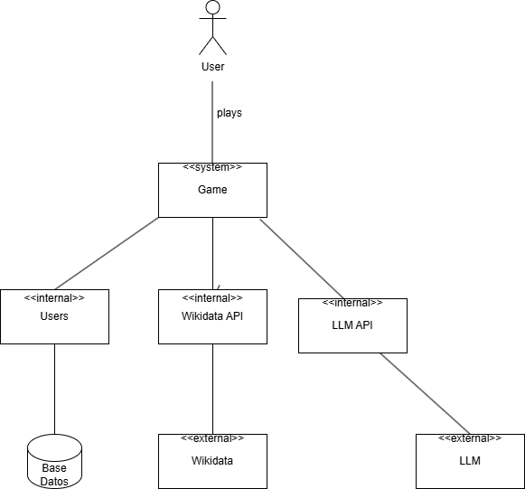
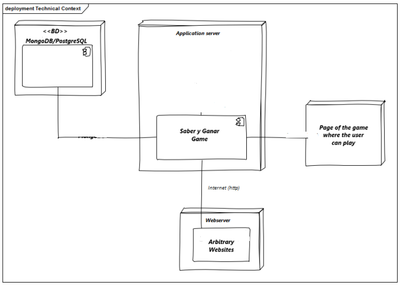

ifndef::imagesdir[:imagesdir: ../images]

[[section-context-and-scope]]
== Context and Scope
This chapter describes the environment and context of the app, who uses the system and on which other systems it depends

ifdef::arc42help[]
[role="arc42help"]
****
.Contents
Context and scope - as the name suggests - delimits your system (i.e. your scope) from all its communication partners
(neighboring systems and users, i.e. the context of your system). It thereby specifies the external interfaces.

If necessary, differentiate the business context (domain specific inputs and outputs) from the technical context (channels, protocols, hardware).

.Motivation
The domain interfaces and technical interfaces to communication partners are among your system's most critical aspects. Make sure that you completely understand them.

.Form
Various options:

* Context diagrams
* Lists of communication partners and their interfaces.

.Further Information

See https://docs.arc42.org/section-3/[Context and Scope] in the arc42 documentation.

****
endif::arc42help[]

=== Business Context

ifdef::arc42help[]
[role="arc42help"]
****
.Contents
Specification of *all* communication partners (users, IT-systems, ...) with explanations of domain specific inputs and outputs or interfaces.
Optionally you can add domain specific formats or communication protocols.

.Motivation
All stakeholders should understand which data are exchanged with the environment of the system.

.Form
All kinds of diagrams that show the system as a black box and specify the domain interfaces to communication partners.

Alternatively (or additionally) you can use a table.
The title of the table is the name of your system, the three columns contain the name of the communication partner, the inputs, and the outputs.

****
endif::arc42help[]

The user in the game interact with the application and he/she Will see a question with its answers and a photo to help him. In this case the questions Will be generate using information with wikidata. The photo is caught from an LLM (not decide still) using its API.
[.text-center]

=== Technical Context

ifdef::arc42help[]
[role="arc42help"]
****
.Contents
Technical interfaces (channels and transmission media) linking your system to its environment. In addition a mapping of domain specific input/output to the channels, i.e. an explanation which I/O uses which channel.

.Motivation
Many stakeholders make architectural decision based on the technical interfaces between the system and its context. Especially infrastructure or hardware designers decide these technical interfaces.

.Form
E.g. UML deployment diagram describing channels to neighboring systems,
together with a mapping table showing the relationships between channels and input/output.

****
endif::arc42help[]

The application has a main part where all the logic is performed for the application(generate questions with WIKIDATA, get the hint from the IA, store users and check if they exists, ...).
For the storage of the users or the questions it's used a database, in this case we use PostgreSQL (In some parts can be used MongoDB for different questions).
Also this part uses different API's to provide info for the question and for getting an image from an IA to let the users have a hint for the question.
Finally we have were the app is going to be deployed to let de user play the game.

