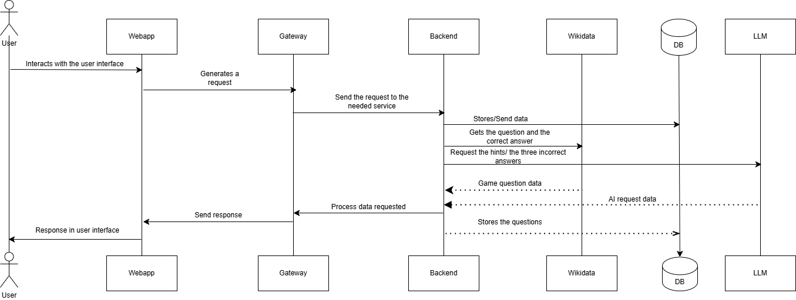

ifndef::imagesdir[:imagesdir: ../images]

[[section-context-and-scope]]
== Context and Scope
This chapter describes the environment and context of the app, who uses the system and on which other systems it depends

ifdef::arc42help[]
[role="arc42help"]
****

.Motivation
The domain interfaces and technical interfaces to communication partners are among your system's most critical aspects. Make sure that you completely understand them.

.Form
Various options:

* Context diagrams
* Lists of communication partners and their interfaces.

.Further Information

See https://docs.arc42.org/section-3/[Context and Scope] in the arc42 documentation.

****
endif::arc42help[]

=== Business Context

ifdef::arc42help[]
[role="arc42help"]
****
.Contents
Specification of *all* communication partners (users, IT-systems, ...) with explanations of domain specific inputs and outputs or interfaces.
Optionally you can add domain specific formats or communication protocols.

.Motivation
All stakeholders should understand which data are exchanged with the environment of the system.

.Form
All kinds of diagrams that show the system as a black box and specify the domain interfaces to communication partners.

Alternatively (or additionally) you can use a table.
The title of the table is the name of your system, the three columns contain the name of the communication partner, the inputs, and the outputs.

****
endif::arc42help[]

The user in the game interact with the application and he/she Will see a question with its answers and if he want there's the possibility of conversate with a chat to obtain hints, each hint will substract points to de user in the game. In this case the questions Will be generate using information with wikidata. For the chat we use a LLM (Gemini) using its library. The other 3 wrong answers are generated by another LLM (QWen or Mistral). There are different types of games, in each game questions have a specific topic like cars or flags. For competing with your friends, you have the possibility of seeing a ranking with all the users that have played the game and it's stats.
[.text-center]

[plantuml]
----
@startuml
set separator none
title System Context Diagram

left to right direction

skinparam {
  arrowFontSize 11
  arrowFontColor #000000
  defaultTextAlignment center
}

hide stereotype

skinparam person<<User>> {
  BackgroundColor #d394e7
  FontColor #000000
  BorderColor #000000
}

skinparam rectangle<<Wichat_EN2A>> {
  BackgroundColor #4CAF50
  FontColor #000000
  BorderColor #000000
}

skinparam rectangle<<Wikidata>> {
  BackgroundColor #F0A500
  FontColor #000000
  BorderColor #000000
}

skinparam rectangle<<EmpathyModels>> {
  BackgroundColor #D32F2F
  FontColor #fffff
  BorderColor #000000
}

skinparam rectangle<<Gemini>> {
  BackgroundColor #D32F2F
  FontColor #fffff
  BorderColor #000000
}

person  "==User\n<size:10>[Person]</size>" <<User>> as User
rectangle "==Wichat_EN2A\n<size:12>[System]</size>" <<Wichat_EN2A>> as Wichat
rectangle "==Wikidata\n<size:12>[System]</size>" <<Wikidata>> as Wikidata
rectangle "==EmpathyModels\n<size:12>[System]</size>" <<EmpathyModels>> as LLMEmpathy
rectangle "==Gemini\n<size:12>[System]</size>" <<Gemini>> as Gemini

User.[thickness=1].>Wichat : "Interacts with\nWichat_EN2A"
Wichat.[thickness=1].>Wikidata : "Retrieves questions\nfrom Wikidata"
Wichat.[thickness=1].>LLMEmpathy : "Generates distractors\nwith QWen or Mistral"
Wichat.[thickness=1].>Gemini : "Generates hints\nwith Gemini"
@enduml
----

=== Technical Context

ifdef::arc42help[]
[role="arc42help"]
****
.Contents
Technical interfaces (channels and transmission media) linking your system to its environment. In addition a mapping of domain specific input/output to the channels, i.e. an explanation which I/O uses which channel.

.Motivation
Many stakeholders make architectural decision based on the technical interfaces between the system and its context. Especially infrastructure or hardware designers decide these technical interfaces.

.Form
E.g. UML deployment diagram describing channels to neighboring systems,
together with a mapping table showing the relationships between channels and input/output.

****
endif::arc42help[]

The application has microservices for the different actions perform in the application( LLMService, Scoreboard, QuestionService, ..).
For the storage of the users or the questions, scoreboard, users,... it's used a database, in this case we use MongoD.
Other service is the llm service that allows diferent microservices of the application to ask to an llm. In our app, we let ask for the hint and for the three wrong answers for the questions.
Another service is the question service that manage the questions and the answers for the game.
Finally we have the webapp service that allows the user to play the game and it's 'the front end' of the application.

