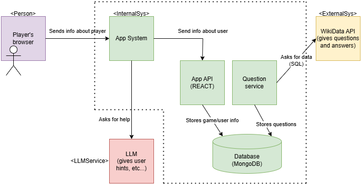

ifndef::imagesdir[:imagesdir: ../images]

[[section-building-block-view]]

== Building Block View

=== Whitebox Overall System

[.text-center]
image::../images/Whitebox Overall System.png[]

Motivation::
This diagram shows the different parts of the application that interact when a user is playing, as well as outside elements used.

Contained Building Blocks::
- **Player**: User that interacts with the game, they will need to fill some sort of login information and be validated before playing.
- **App System**: Main place where the game takes place.
- **WikiData API**: External API, which will be used to generate questions and answers.
- **LLM API**: External use of LLM (QWen) to allow the user to get hints from an artificial intelligence. 

Important Interfaces::
As we can see in the diagram, the user will interact with the App Internal System, which will first ask for a list of questions and answers from the WikiData API. Then, as well as showing the questions to the player, it will allow them to see an AI generated hint.

==== Container Diagram
[.text-center]

Motivation::
This diagram shows in more detail the different (**internal**) parts of the application that interact when a user is playing, as well as outside elements used.

Contained Building Blocks::
- **Player's browser**: The browser will send us some information about the user that interacts with the game, they will need to fill some sort of login information and be validated before playing. 
- **App System**: Main place where the game takes place. Will receive some information about the user from the browser (probably using a proxy) and communicate with the other internal parts of the app, or external (like the LLM functionality).
- **App API**: Probably programmed in SpringbReactoot. This part of the app will receive the information about the user from the browser and save it in the database, as well as information about the status of the game.
- **Question generator**: This part will first ask the WikiData API for some questions and answers, which it will later store in the database.
- **Database**: In MongoDB. Will receive information about the user/state of the game/questions and answers.
- **WikiData API**: External API, which will be used to generate questions and answers.
- **LLM API**: External use of LLM (for now it will be QWen) to allow the user to get hints from an artificial intelligence. 

Important Interfaces::
As we can see in the diagram, the user will interact with the App Internal System first, which will ask for information about the user from their browser (proxy). This container will send this info to the app API which will store it in the database. 
+
Then, when the game starts, the Question generator will use the WikiData API to get a list of questions and answers, which will be stored in the database as well. Then, as well as showing the questions to the player, the App System container will communicate with the LLM Container to allow players to see an AI generated hint.

