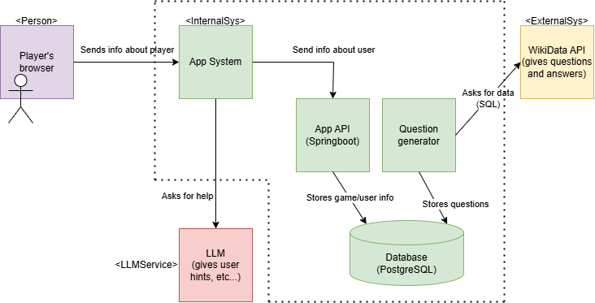

ifndef::imagesdir[:imagesdir: ../images]

[[section-building-block-view]]

== Building Block View

ifdef::arc42help[]
[role="arc42help"]
****
.Content
The building block view shows the static decomposition of the system into building blocks (modules, components, subsystems, classes, interfaces, packages, libraries, frameworks, layers, partitions, tiers, functions, macros, operations, data structures, ...) as well as their dependencies (relationships, associations, ...)

This view is mandatory for every architecture documentation.
In analogy to a house this is the _floor plan_.

.Motivation
Maintain an overview of your source code by making its structure understandable through
abstraction.

This allows you to communicate with your stakeholder on an abstract level without disclosing implementation details.

.Form
The building block view is a hierarchical collection of black boxes and white boxes
(see figure below) and their descriptions.

image::05_building_blocks-EN.png["Hierarchy of building blocks"]

*Level 1* is the white box description of the overall system together with black
box descriptions of all contained building blocks.

*Level 2* zooms into some building blocks of level 1.
Thus it contains the white box description of selected building blocks of level 1, together with black box descriptions of their internal building blocks.

*Level 3* zooms into selected building blocks of level 2, and so on.

.Further Information

See https://docs.arc42.org/section-5/[Building Block View] in the arc42 documentation.

****
endif::arc42help[]

=== Whitebox Overall System

ifdef::arc42help[]
[role="arc42help"]
****
Here you describe the decomposition of the overall system using the following white box template. It contains

 * an overview diagram
 * a motivation for the decomposition
 * black box descriptions of the contained building blocks. For these we offer you alternatives:

   ** use _one_ table for a short and pragmatic overview of all contained building blocks and their interfaces
   ** use a list of black box descriptions of the building blocks according to the black box template (see below).
   Depending on your choice of tool this list could be sub-chapters (in text files), sub-pages (in a Wiki) or nested elements (in a modeling tool).

 * (optional:) important interfaces, that are not explained in the black box templates of a building block, but are very important for understanding the white box.
Since there are so many ways to specify interfaces why do not provide a specific template for them.
 In the worst case you have to specify and describe syntax, semantics, protocols, error handling,
 restrictions, versions, qualities, necessary compatibilities and many things more.
In the best case you will get away with examples or simple signatures.

****
endif::arc42help[]

_**<Overview Diagram>**_
[.text-center]
image::../images/Whitebox Overall System.png[]

Motivation::

This diagram shows the different parts of the application that interact when a user is playing, as well as outside elements used.

Contained Building Blocks::
- **Player**: User that interacts with the game, they will need to fill some sort of login information and be validated before playing.
- **App System**: Main place where the game takes place.
- **WikiData API**: External API, which will be used to generate questions and answers.
- **LLM API**: External use of LLM (probably Gemini) to allow the user to get hints from an artificial intelligence. 

Important Interfaces::
As we can see in the diagram, the user will interact with the App Internal System, which will first ask for a list of questions and answers from the WikiData API. Then, as well as showing the questions to the player, it will allow them to see an AI generated hint.

ifdef::arc42help[]
[role="arc42help"]
****
Insert your explanations of black boxes from level 1:

If you use tabular form you will only describe your black boxes with name and
responsibility according to the following schema:

[cols="1,2" options="header"]
|===
| **Name** | **Responsibility**
| _<black box 1>_ | _<Text>_
| _<black box 2>_ | _<Text>_
|===

If you use a list of black box descriptions then you fill in a separate black box template for every important building block .
Its headline is the name of the black box.
****
endif::arc42help[]

==== Container Diagram

_**<Overview Diagram>**_
[.text-center]

Motivation::

This diagram shows in more detail the different (**internal**) parts of the application that interact when a user is playing, as well as outside elements used.

Contained Building Blocks::
- **Player's browser**: The browser will send us some information about the user that interacts with the game, they will need to fill some sort of login information and be validated before playing. 
- **App System**: Main place where the game takes place. Will receive some information about the user from the browser (probably using a proxy) and communicate with the other internal parts of the app, or external (like the LLM functionality).
- **App API**: Probably programmed in Springboot. This part of the app will receive the information about the user from the browser and save it in the database, as well as information about the status of the game.
- **Question generator**: This part will first ask the WikiData API for some questions and answers, which it will later store in the database.
- **Database**: In PostgreSQL. Will receive information about the user/state of the game/questions and answers.
- **WikiData API**: External API, which will be used to generate questions and answers.
- **LLM API**: External use of LLM (for now it will be Empathy) to allow the user to get hints from an artificial intelligence. 

Important Interfaces::
As we can see in the diagram, the user will interact with the App Internal System first, which will ask for information about the user from their browser (proxy). This container will send this info to the app API which will store it in the database. 
+
Then, when the game starts, the Question generator will use the WikiData API to get a list of questions and answers, which will be stored in the database as well. Then, as well as showing the questions to the player, ithe App System container will communicate with the LLM Container to allow players to see an AI generated hint.

