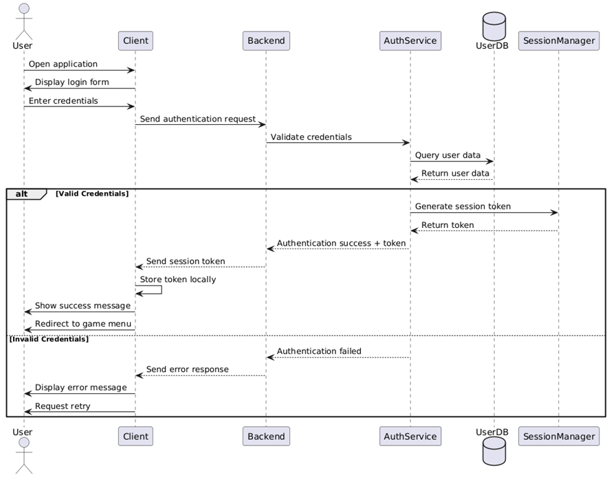
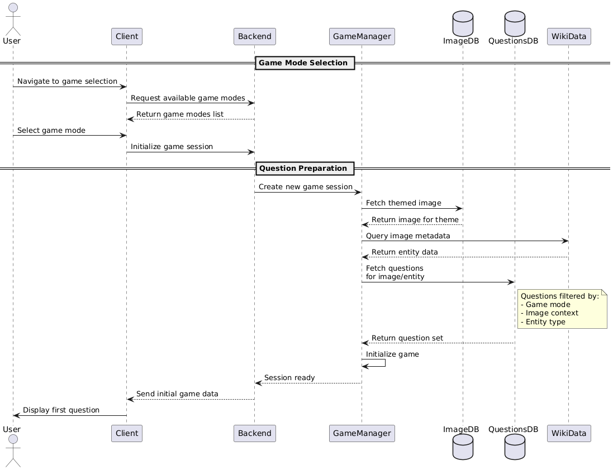
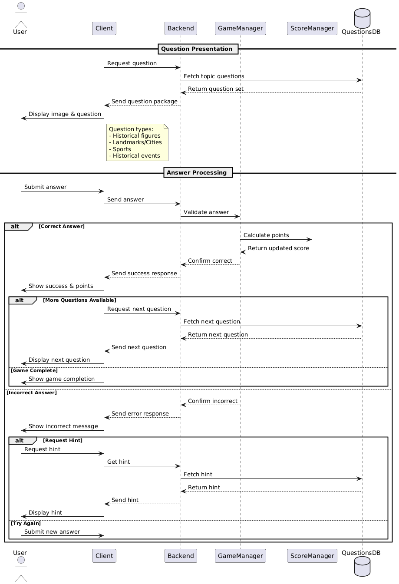
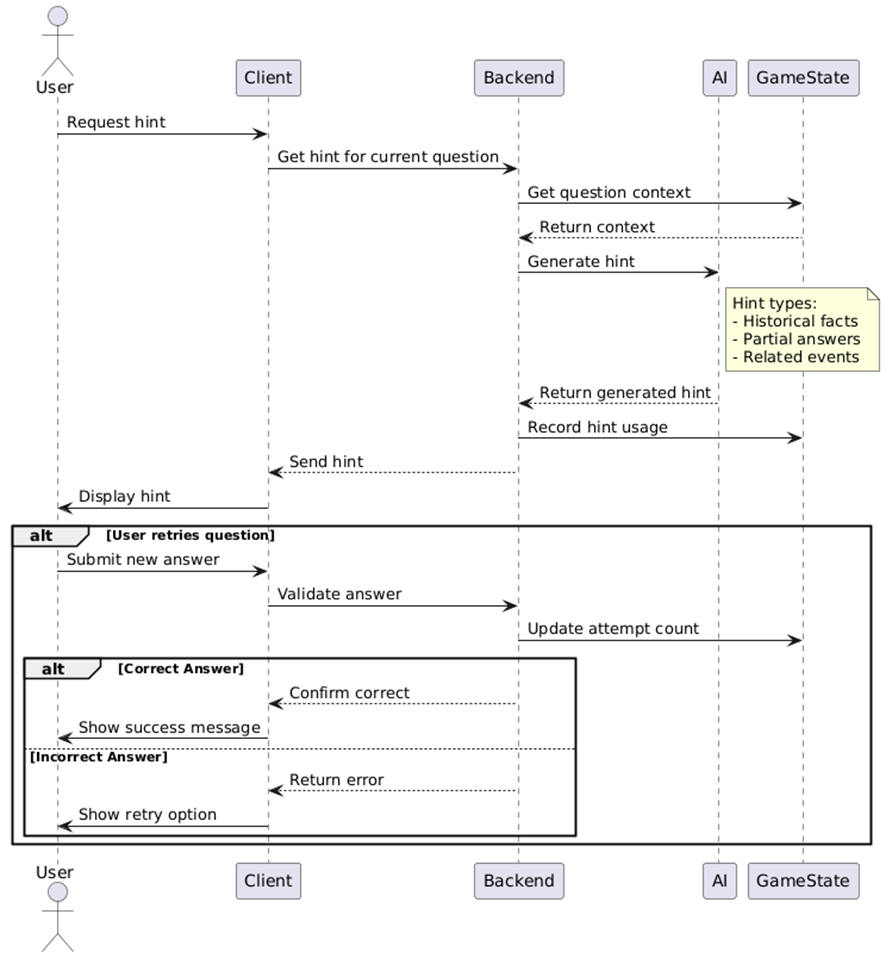
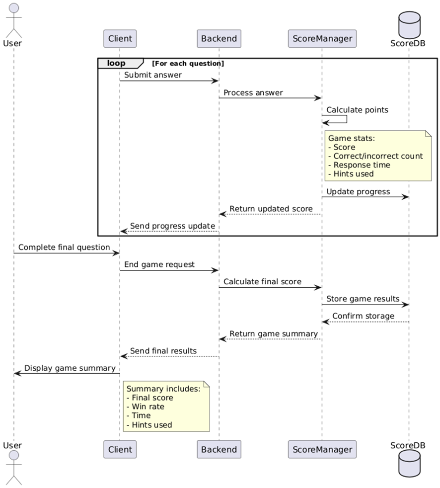
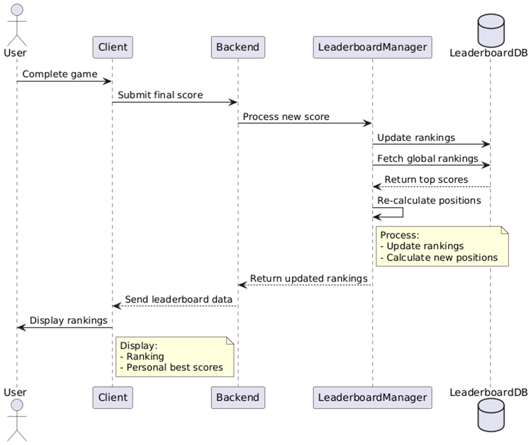

ifndef::imagesdir[:imagesdir: ../images]

[[section-runtime-view]]
== Runtime View
=== <Runtime Scenario 1. Login and Authentication>
•	The user opens the application and is asked to log in.
•	They enter their credentials (username and password).
•	The client application sends an authentication request to the backend.
•	The backend verifies the credentials by checking in its database.
•	If login is successful, a session token is generated and sent back to the client.
•	The client stores the token for future requests.
•	If login fails, an error message is displayed, asking the user to try again.

//[plantuml,"Sequence diagram",png]

=== <Runtime Scenario 2. Game Mode and Question Selection>
After logging in, the user navigates to the game selection screen.
•	The user selects a game mode (e.g., cities, historical figures, sports…).
•	The client requests a set of questions from the backend.
•	The game retrieves a set questions based on the image from WikiData.
•	The questions and associated images are sent to the client.
•	The game session starts, displaying the first question.

=== <Runtime Scenario 3. Image-Based Questioning>
•	The app presents an image to the user based on the game topic.
•	The app gets the set of questions related to the image from the QuestionsDB, such as:
    o	"Which historical figure is shown in this photo?"
    o	"What city is this landmark located in?"
    o	"Which sport is depicted in this picture?"
    o	"Which historical event is depicted in this picture?"

•	The user selects an answer from multiple-choice options or types in a response.
•	The client sends the answer to the backend for validation.
•	The backend checks if the response matches the correct answer.
    •	If correct:
        o	The user earns points.
        o	The next question is displayed.
    •	If incorrect:
        o	The user can try again or request a hint

=== <Runtime Scenario 4. Hint System and AI Assistance>
•	If the user does not know the answer, they can request a hint.
•	The backend calls the AI to generate a hint based on the image and question.
•	Types of hints may include:
    o	A brief historical fact about the person, place, or event.
    o	A partial reveal of the answer.
    o	A clue referencing a relatedevent.
    o	Eliminating one wrong answer choices (if it is a multiple-choice question).
•	The hint is sent to the client and displayed to the user.
•	The user can then retry answering the question.

=== <Runtime Scenario 5. Game Progress and Score Management>
•	The game continues through a predefined number of images and questions.
•	The backend keeps track of the user’s progress, including:
    o	Score.
    o	Number of correct and incorrect answers.
    o	Time taken per question.
•	After the final question, the backend calculates the final score and stores it in the database.
•	The client displays a summary of the results.

=== <Runtime Scenario 6. . Leaderboard and Social Features>
•	The user’s score is compared against other players.
•	The backend updates the leaderboard using the scores database or a dedicated one.
•	The client displays rankings, showing top players.

