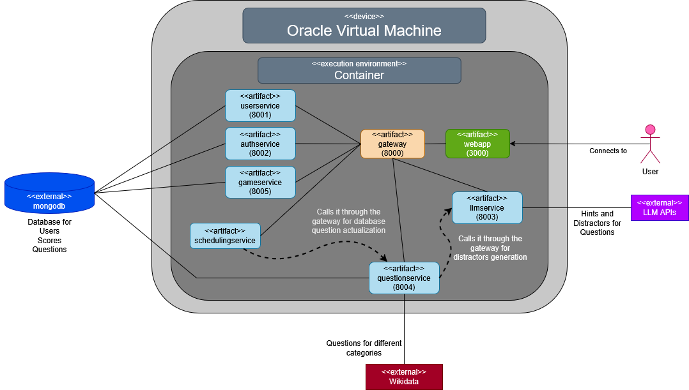

ifndef::imagesdir[:imagesdir: ../images]

[[section-deployment-view]]

== Deployment View
**Overview Diagram**
[.text-center]

Motivation::

The application is build using Docker and an Oracle Virtual Machine. Using both together creates a combination of the portability and efficiency of the containers obtained by the use of Docker with the additional security and isolation provided by virtual machines. 

Docker is used for the deployment of the application both for developing (local deployment) and when for the final result in the VM. It is a containerization platform that packages applications and their dependencies into lightweight, portable containers, ensuring consistency across environments.

Quality and/or Performance Features::

Expanding on the advantages of the combined use of Docker and a VM (and also their independent characteristics that add their own value), we can remark:
- **Isolation**: Not only because of the container-level isolation provided by Docker (which helps prevent dependency conflicts), but also because the additional OS-level isolation thanks to the use of an VM.
- **Security**: The VM can act as a security boundary if a container is ever compromised.
- **Resource Management and Allocation**: The VM has a dedicated CPU, RAM and disk which can be allocated specifically for Docker, and Docker itself reduces resource consumption by sharing the OS kernel.
- **Portability and Compatibility**: Using Docker ensures that the application works in the exact same way across different environments. 
- **More**: Easy recovery and backup (this can also be attributed to the use of a Github repository), flexible scalability...

Mapping of Building Blocks to Infrastructure::

Below there is a list with the current building blocks defined in the application:
- **Webapp**: Its port (3000) is the one the user will connect to when interacting with the application, as it is its graphic user interface and will work as the frontend.
- **Gateway**: As its name suggets, it works as the interface that comunicates the webapp with the rest of the services and the services between each other, counting with different endpoints for said purpose.
- **Userservice**: It will be in charge of the user management.
- **Authservice**: On the same level as the previous one, it will be the one that handles the authentication of users.
- **Llmservice**: This one is also on the same level as the two before it, and it manages the LLM used in the application. The LLM API will be used interchangeably between the models provided for Empathy (generation of distractors) and Gemini (generation of hints for the chat).
- **Questionservice**: This service communicates with the Wikidata API and returns a type of question, with a picture attached to it and a correct answer.
- **Schedulingservice**: This is an internal service used to update the questions from the database that calls the questionservice from the gateway periodically.
- **Gameservice**: This service is used for the management of rankings, each game played and the scores of users.
- **Database**: The database that will contain all the data of the application. The one used is an external MongoDB database with several collections for each service (users, questions...). As of now, it is used to store users, their passwords and their profile information, scores for each game played and the questions for the game.

It is also worth mentioning the use of other tools that are currently impelmented in the application:

- **APIs**: The Wikidata API, the LLM APIs...
- **Prometheus and Grafana**: This tools combined allow to monitor and observe the system creating statistics about it, although they were not implemented in the release.